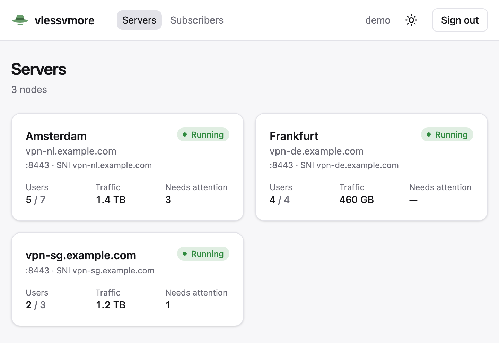
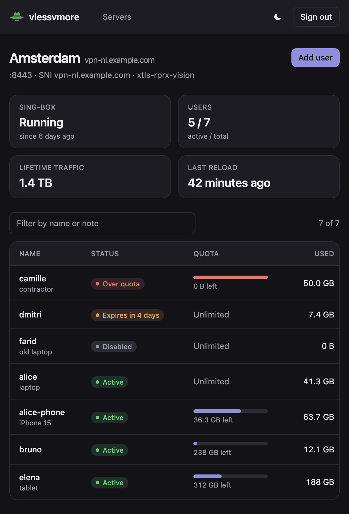
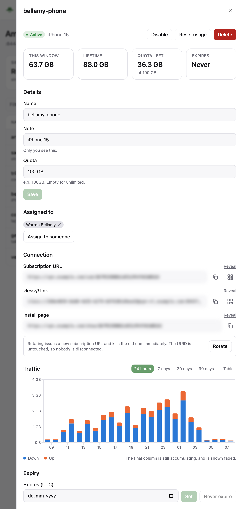
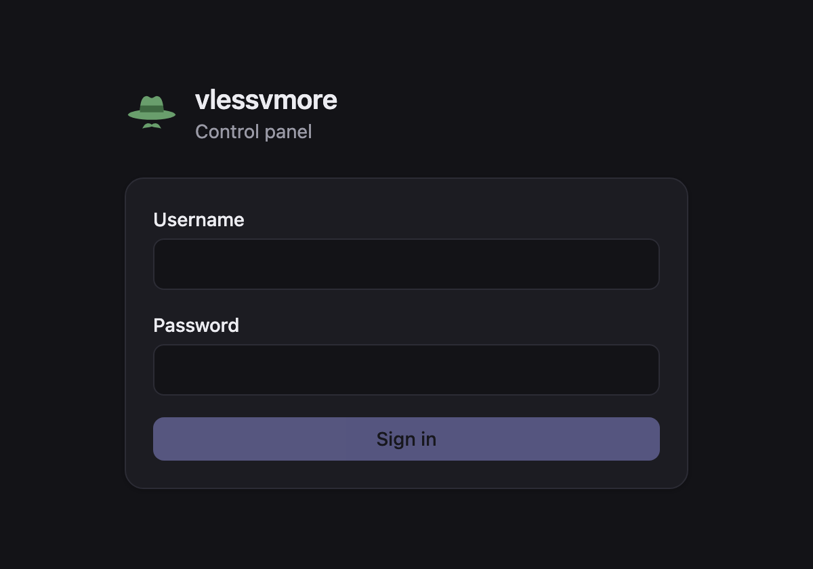
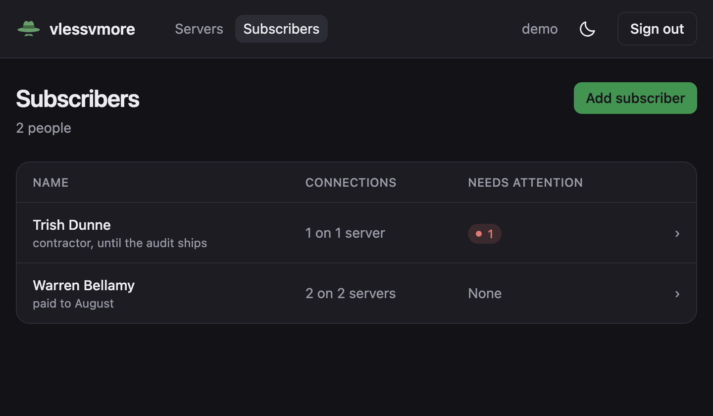
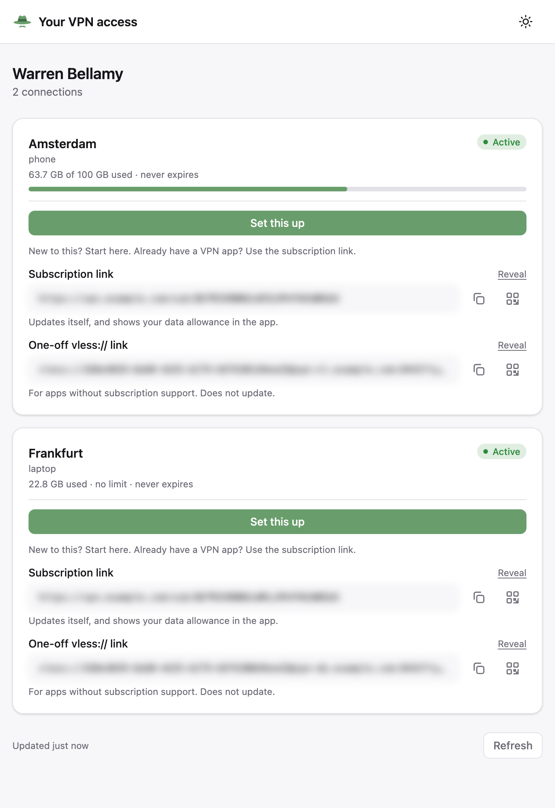

# vlessvmorectl

A web control panel for one or more [vlessvmore](https://github.com/reeywhaar/vlessvmore)
servers.

vlessvmore has a complete management API but no interface, so everything is
`docker exec vlessvmore vlessvmore user add alice` or a hand-rolled `curl`. Running more
than one node means logging into each host separately, and there is nowhere to see usage
across all of them. This is that missing piece: a login, an overview of every node, and
the user management you would otherwise do at a shell — links, QR codes, subscription
URLs, quotas, expiry and traffic history.

It also answers the other half of that problem: **giving a person one link.** Group the
accounts somebody holds — on any number of nodes — under a *subscriber*, and they get a
single URL showing all of them, with QR codes, subscription links and how much data they
have left. No login, and no panel: it is a separate page with its own bundle.

It holds no VPN state of its own. Every node remains the source of truth for its own
users; this only asks and tells.

<p align="center">
  
  
</p>
<p align="center">
  
  
</p>
<p align="center">
  
  
</p>

Real captures of the panel; only the data is invented. Regenerate them with
[`docs/screenshots/capture.sh`](docs/screenshots/capture.sh).

## Contents

- [How it fits together](#how-it-fits-together) — the proxy, and why a browser never holds a node token
- [Install](#install) — mint a token, `docker compose up`, create the first administrator
- [Configuration](#configuration) — one environment variable that matters
- [The CLI](#the-cli) — panel logins; VPN users live on the nodes
- [Subscribers, and the page you hand them](#subscribers-and-the-page-you-hand-them) — one link per person, and what that link is worth
- [Backups](#backups) — copying one directory, and the sidecar that does it hourly
- [Things worth knowing](#things-worth-knowing) — silent reload failures, quota counters, capability URLs
- [Security](#security) — what keeps `/api/proxy` from being a liability
- [Development](#development) — tests, and where the 7 MB goes
- [Not implemented](#not-implemented) — including one thing that never will be

## How it fits together

```
                    ┌──────────────────────────────────────────┐
  operator ────────▶│ vlessvmorectl  :80                       │
       cookie       │  POST /api/login                         │
   vlessvmore_auth  │  GET  /api/me                            │
                    │  GET  /api/servers  → [{id, url}]        │  ← no tokens
                    │  ANY  /api/proxy?url=…                   │
                    │  ANY  /api/subscribers…                  │
                    │  the panel bundle                        │
                    │                                          │
  subscriber ──────▶│  GET  /access/{token}                    │  ← no session
       no cookie    │  GET  /api/access/{token}                │
                    │  a separate bundle                       │
                    └───────────────┬──────────────────────────┘
                                    │  Authorization: Bearer <token>
                                    ├──▶ https://vpn-nl.example.com/api/*
                                    └──▶ https://vpn-de.example.com/api/*
```

**The browser never receives a bearer token.** It asks this service to make each call and
this service attaches the credential. That is the central design decision, and it buys
four things:

- A full-control token for every VPN node never sits in a laptop's memory, so an XSS —
  including one arriving through a compromised npm dependency — cannot exfiltrate them.
- There is no `cors_origins` to configure and remember on every node. A forgotten one
  would otherwise fail as a browser CORS error that leaves no trace in any log you own.
- **No node's management API has to be reachable from the internet at all.** The panel can
  reach them over a private Docker network.
- Go sees the real transport error — DNS, refused, TLS, timeout — where a browser making
  the same cross-origin request only ever gets an opaque `TypeError`. The panel's error
  messages are accurate rather than guessed.

The cost is that this service is now a single point of connectivity: a node reachable from
your browser but not from this host is unmanageable. See [Not implemented](#not-implemented).

## Install

```sh
# On each vlessvmore node, mint a token for the panel. Shown once, never again.
docker exec vlessvmore vlessvmore token create panel --raw
```

```sh
# Here
mkdir -p data
cp .env.example .env      # put the url|token pairs in it
docker compose up -d

# Nobody can sign in until an administrator exists. There is deliberately no way to
# create the first one from the web — that would be a race against whoever reaches the
# URL first — so a shell on this host is the bootstrap credential.
docker exec vlessvmorectl vlessvmorectl users add alice
```

Then open the panel and sign in.

### compose

No `docker-compose.yml` ships with this repo; it is four lines of yours plus this:

```yaml
services:
  vlessvmorectl:
    image: ghcr.io/reeywhaar/vlessvmorectl:latest
    container_name: vlessvmorectl
    restart: unless-stopped

    # The tokens must not live in a committed file.
    env_file: .env

    volumes:
      # admins.json, sessions.json and subscribers.json. Without this mount every
      # administrator disappears when the container is replaced — and the only way back
      # in is a shell on this host — and every share link stops working.
      - ./data:/var/lib/vlessvmorectl

    healthcheck:
      test: ["CMD", "vlessvmorectl", "healthcheck"]
      interval: 30s
      timeout: 5s
      start_period: 5s
      retries: 3

    networks:
      - caddy

    labels:
      # This service issues session cookies and proxies credentialed calls. Terminate TLS
      # in front of it.
      caddy: panel.example.com
      caddy.reverse_proxy: "{{upstreams 80}}"
      caddy.log.output: stdout
      caddy.log.format: json

networks:
  caddy:
    external: true
```

Nothing is published to the host: Caddy dials the container directly. If you would rather
run it standalone, add `ports: ["127.0.0.1:8080:80"]` and put your own TLS in front.

**Better still**, if the panel and the nodes share a Docker network, point
`VLESSVMORE_SERVERS` at `http://vlessvmore-nl:80|TOKEN` and stop publishing each node's
management API entirely. Proxying is what makes that possible.

## Configuration

Everything is environment. There is no config file, because the only thing this program
needs to be told is which nodes it manages.

| variable | meaning |
| --- | --- |
| `VLESSVMORE_SERVERS` | comma-separated `url|token` pairs. Newlines work too. |
| `VLESSVMORE_TOKENS` | accepted as an alias for the above |
| `VLESSVMORE_LOG_LEVEL` | `debug`, `info` (default), `warn`, `error` |
| `VLESSVMORECTL_DATA_DIR` | overrides `/var/lib/vlessvmorectl` |

```
VLESSVMORE_SERVERS="https://vpn-nl.example.com|MHDJWEZ5…,https://vpn-de.example.com|QK7M2XA9…"
```

A malformed entry, or two entries for the same node, is a startup error — that is a typo,
and the container logs are where you will look for it. **Zero servers is not an error**:
the panel comes up, you sign in, and the empty state tells you which variable to set.

The listen port is `:80` and is not configurable. Remap it with a port binding, the same
stance vlessvmore takes.

## The CLI

```
vlessvmorectl serve
vlessvmorectl users add <username> [password]
vlessvmorectl users ls [--json]
vlessvmorectl users rm <username> [-y] [--force]
vlessvmorectl users passwd <username> [password]
vlessvmorectl users rename <username> <new-username>
vlessvmorectl version
```

These are *panel* logins. VPN users live on each node and are managed from the panel
itself.

Three ways to give a password:

```sh
vlessvmorectl users add alice hunter2          # warns: it is now in your shell history
vlessvmorectl users add alice                  # prompts, with echo off
echo hunter2 | vlessvmorectl users add alice --password-stdin
```

`serve` notices an out-of-band change to `admins.json` within a second, so
`docker exec … users add` takes effect on a running panel with no restart, and
`users passwd` signs that person out **everywhere, immediately** — which is the entire
point of changing a password after a suspected compromise.

`users rename` signs nobody out, not even on their other devices. An administrator has a
permanent id that a session refers to, so their username is only a label. Giving the freed
name to somebody else creates a different administrator who inherits nothing.

`users rm` refuses to remove the last administrator without `--force`, since that locks
everyone out of a running panel.

`sessions.json` and `subscribers.json` are written only by the running panel, never by the
CLI — one writer each, which is what lets two processes share a data directory without a
lock or a socket protocol, and the CLI's handle on `subscribers.json` is read-only in code
rather than by convention. `admins.json` is the one file both write, so the panel refuses to
write over a version that changed underneath it and tells you to try again.

## Subscribers, and the page you hand them

A **subscriber** is a person, not an account. Create one, attach the VPN accounts they hold
— on any number of nodes — and copy their share link. Opening it needs no login and shows,
for each account: which server, whether it is working, how much data is left, when it
expires, the `vless://` link, the subscription URL and QR codes for both.

Attaching works from both ends, because either end can be where you are standing when the
question comes up. A subscriber's drawer lists their connections and has **Attach an
account**; a VPN user's own drawer has an **Assigned to** row that does the same in
reverse, for when you have just created an account and are already looking at it. The list
carries a per-person count of connections that need attention — out of data, expired,
switched off, deleted from its node, or on a node this panel no longer has configured — so
"who is about to complain" is answered without opening anybody.

This is the one thing the panel owns that a node does not. An attachment is a *reference*
— a node id and an account id — never a copy: nothing is snapshotted, so a subscriber
record cannot go stale, and an account deleted on a node simply shows as gone. It lives in
`subscribers.json` next to `admins.json`, written only by the running panel.

**The share page is a separate bundle**, built from its own Vite entry, with its own React
root and no router, no query client and no API dispatcher. That is a boundary rather than
an optimisation: the operator's pages are not in the module graph a subscriber's browser
loads, so keeping them out does not depend on nobody ever writing the wrong import. It does
not make the panel bundle unreachable — static files on a public origin can be fetched by
anyone who knows the name — but it decides what a stranger is *served*.

Three things worth knowing before you hand a link out:

- **The link is a capability, and it is minted once.** There is no rotate. Anyone holding it
  sees every account attached to that subscriber. If one leaks, switch the subscriber off —
  instant, reversible, and it disconnects nobody — or delete them and start again.
- **Switching a subscriber off does not disconnect anyone.** It stops the page answering.
  The accounts themselves keep working, because they live on the node and know nothing about
  this. The two revocations are independent: rotating a node's subscription token changes
  what the page *shows*, and does not invalidate the share link.
- **The token is in the URL, so it will appear in your reverse proxy's access log.** That is
  the standing cost of capability URLs — vlessvmore's own `/sub/` and `/show/` URLs have it
  too. This service keeps it out of its own logs, replacing it with a fingerprint you can
  derive from the token you hold.

## Backups

Everything this panel owns is three JSON files in one directory, so a backup is a copy of
that directory and a restore is putting it back:

```sh
tar czf vlessvmorectl-$(date -u +%Y%m%d_%H%M%S).tgz data
```

`restic`, Kopia, a cron job or the sidecar below — anything that can copy a directory works.
There is no database to quiesce and no endpoint to call: the panel writes each file by
rename, so a reader always sees a whole file rather than half of one.

Two things are not in it. The node tokens live in `.env`, and every VPN account lives on its
node, so an archive restores the panel — administrators, sessions, subscribers and their
share links — not the VPN.

### The backup sidecar

[`backup/`](backup/) is a second image in this repo that does the above on a schedule:
archive, keep a local copy, upload to [backio](https://github.com/Reeywhaar/backio), prune,
sleep, repeat.

```
ghcr.io/reeywhaar/vlessvmorectl-backup:latest
```

Append this to the compose file from [Install](#compose). It needs no network path to the
panel and no credential of the panel's; it mounts the data directory read-only and reads it.
vlessvmore's equivalent sidecar has to fetch from an unauthenticated endpoint instead,
because a live SQLite database cannot be copied file by file.

```yaml
  backup:
    image: ghcr.io/reeywhaar/vlessvmorectl-backup:latest
    container_name: vlessvmorectl-backup
    restart: unless-stopped

    volumes:
      # The panel's data directory, read-only — this only ever reads it. Mounted at the
      # same path the panel uses, so one VLESSVMORECTL_DATA_DIR means the same thing to
      # both containers if you ever set it.
      - ./data:/var/lib/vlessvmorectl:ro
      # Local copies, rotated by the same retention policy as the remote: 3 from the newest
      # day, 3 daily, 1 weekly, 1 monthly. Drop this mount and no local copies are kept at
      # all — each archive is uploaded from a temp directory and deleted.
      - ./backups:/backups

    networks: [backup-net]

    environment:
      # Remote directory. Must match the one granted to BACKUP_TOKEN.
      - BACKIO_SUBDIRECTORY=vlessvmorectl
      - BACKUP_INTERVAL=3600

      # Omit BACKUP_TOKEN entirely to keep backups local only. `create` is enough to
      # upload; `read,delete` as well for the remote retention policy to run:
      #   docker exec backio /backio issue-token "gdrive vlessvmorectl create,read,delete"
      - BACKIO_PROVIDER=gdrive
      - BACKUP_TOKEN=your-backio-token

      # Set this and the archive is uploaded as a 7z AES-256 zip instead of a plain tgz.
      # WITHOUT THIS PASSWORD THE BACKUP IS UNRECOVERABLE — store it somewhere other than
      # this host.
      # - BACKUP_PASSWORD=change-me-and-store-it-safely

  # backio forwards archives to a cloud provider (Google Drive, S3, ...).
  # See https://github.com/reeywhaar/backio
  backio:
    image: ghcr.io/reeywhaar/backio:latest
    container_name: backio
    restart: unless-stopped
    volumes:
      - backio-data:/data
    networks: [backup-net]
    environment:
      # base64-encoded rclone config (e.g. from backio's ./setup-gdrive.sh)
      - RCLONE_CONF_BASE64=${RCLONE_CONF_BASE64}

networks:
  backup-net:
    driver: bridge

volumes:
  backio-data:
```

| variable | default | what |
| --- | --- | --- |
| `BACKIO_SUBDIRECTORY` | **required** | remote directory; must match the token's grant |
| `VLESSVMORECTL_DATA_DIR` | `/var/lib/vlessvmorectl` | the directory to archive, i.e. where you mounted the panel's data |
| `BACKUP_INTERVAL` | `3600` | seconds between backups |
| `BACKIO_URL` | `http://backio:8080` | backio |
| `BACKIO_PROVIDER` | `gdrive` | rclone remote name |
| `BACKUP_TOKEN` | unset | backio token; **unset means local copies only, no upload** |
| `BACKUP_PASSWORD` | unset | when set, upload a 7z AES-256 `.zip` instead of the plain `.tgz` |
| `BACKUP_DIR` | `/backups` | where local copies are kept; set it and copies are always kept there |

Archives are named `vlessvmorectl-<YYYYMMDD_HHMMSS>.<tgz|zip>`, mode `0600`, and hold every
file under a single top-level `data/` — so extracting one over a deployment directory puts
each file back where the compose file mounts it from:

```sh
docker compose stop vlessvmorectl
tar xzf backups/vlessvmorectl-20260730_031500.tgz -C .   # writes ./data/*.json
docker compose start vlessvmorectl
```

Stop the panel first: it keeps `subscribers.json` in memory and writes that copy back on the
next change, so restoring underneath a running panel gets your file overwritten again.

**An empty data directory is an error, not an empty archive** — that one uploads cleanly,
satisfies retention, prunes the good copies behind it, and is discovered on the day it is
needed. The likeliest cause is a mount that is not where this expects it.

**Mount nothing at `/backups` and no local copies are kept at all.** The image does not create
that directory and Docker creates a mount target that the image is missing, so the directory
exists exactly when a volume is mounted over it. Without one, each archive goes to a temp
directory that the run deletes once the upload is done — a copy in the container's writable
layer would vanish with the container anyway, which is the one moment a local copy would have
earned its keep. With neither a volume nor a `BACKUP_TOKEN` there is nowhere to put the archive,
and the run says so and exits non-zero rather than backing up to nothing.

**Retention, applied to both the local directory and the remote:** the three newest archives
from the newest day, the newest archive of each of the three newest days, and the newest archive
of the previous week and the previous month. So seven archives at most, whatever the interval.

Every slot is a calendar bucket keeper — the newest archive of a day, an ISO week, a month —
rather than an archive of a given age. A bucket's keeper is settled once the bucket ends, so each
run prunes to the same set the last one did, and the week and month slots hold real week- and
month-old copies instead of whatever the first run happened to pin. Names it does not recognise
are left alone, including the sibling project's `vlessvmore-…` archives.

Pruning the remote needs `read` and `delete` on the backio token; with a `create`-only token
the uploads still work and the remote is not pruned. Every run logs one JSON line per step to
stdout, and a failed run is logged and retried at the next interval rather than taking the
container down.

**What an archive is worth, if it leaks:** `admins.json` is bcrypt hashes, not passwords, and
`sessions.json` is cookie hashes, not cookies. `subscribers.json` is the sensitive one: share
tokens in the clear, each a capability granting sight of that subscriber's accounts. No node
bearer token is in there at all. Hence `BACKUP_PASSWORD` when the remote is not yours — and
keep that password somewhere other than the host being backed up.

## Things worth knowing

**Upgrading to this version signs everyone out once.** Administrators gained a permanent
id, and sessions now refer to it rather than to a username. Sessions saved by an older
build have no id to refer to, and inventing one from the username would be guessing, so
they are dropped on the first start and everyone signs in again. `admins.json` is rewritten
once at startup to record the new ids; the old records keep their username as their id, so
nothing else moves. Roll back after that and the old build will refuse to read the file
rather than misread it — restore `admins.json` from a backup if you need to.

**vlessvmore has no 401.** Every refusal it makes — no token, revoked token, unknown path,
wrong method — is an identical `404 page not found` in `text/plain`, padded to a fixed
60–150 ms, deliberately. Its genuine not-founds are JSON. That content type is the only
way to tell "your token is wrong" from "no such user", and this panel reads it: a rejected
token gets a message naming the environment variable to look at, not a shrug.

**A saved change is not necessarily a live one.** Changing a user rewrites the node's
sing-box config and reloads it, and the reload can fail on its own — the node answers 2xx
with `reloaded: false`. The panel shows a sticky banner in that case, not a toast that
disappears: an operator who has just disabled someone believes they are disconnected, and
until that clears they are not. The banner heals itself when any later reload succeeds.

**Reloads drop connections.** They are coalesced on the node, and this panel never reloads
on a timer — only when you change something, or press the retry button.

**`with_v2ray_api` or nothing.** If a node's sing-box was built without that tag there are
no per-user traffic counters at all: usage stays at zero and quotas never fire, silently.
The panel checks and says so on the server card.

**Traffic is counted in whole UTC hours**, so the newest bucket in a chart is always still
accumulating. It is drawn faded rather than as a cliff, because otherwise every graph
looks like it ends in an outage.

**Subscription and install URLs are capabilities.** Anyone holding one can connect as that
user. They are blurred until revealed, never logged, and rotating a subscription token
invalidates the old URL immediately without disconnecting anyone — the UUID is untouched.
A subscriber's share link is a capability of the same class; see
[Subscribers](#subscribers-and-the-page-you-hand-them).

**Sessions survive a restart**, so `docker compose restart` does not sign everyone out.
They live in `sessions.json` in the data directory, and what is stored is a *hash* of each
cookie value rather than the value — the same discipline vlessvmore uses for
`tokens.json`. Reading that file gets you a list of digests, not a list of credentials.
Signing out removes the record, so a revoked session does not come back from the dead
either.

**The session cookie is `Secure` only over TLS.** Making it unconditional is stricter, but
with the port fixed at `:80` its failure mode is a browser silently discarding the cookie
and a login that "succeeds" and then 401s forever, with no error anywhere. Instead a login
over plain HTTP from a non-loopback host logs a warning naming the consequence.

## Security

`/api/proxy` takes a URL from an authenticated client and fetches it with a credential
attached. That is what it is for; what keeps it from being a liability is the set of checks
around it:

- A session is required before the URL is even parsed.
- The URL's origin must be an **exact match** for a configured node — a map lookup, never
  a prefix comparison, because `https://vpn.example.com.attacker.test` has a configured URL
  as a prefix and is a domain anyone can register.
- Only `/api/` paths are proxied. `/sub/`, `/show/` and `/static/` are public capability
  URLs meant to be opened directly, so routing them through here would add reach without
  adding value.
- Only `GET`, `POST`, `PATCH`, `DELETE`.
- Redirects are never followed, so a redirect cannot carry the token off-origin.
- Request headers are an allowlist: the browser's own `Authorization` and `Cookie` never
  reach a node. Response headers are an allowlist of exactly `Content-Type`.
- Errors and logs route through a redaction helper. There are tests asserting that no
  response body and no log line ever contains a token.

`GET /api/access/{token}` is the other endpoint that makes credentialed calls to a node,
and the only one a stranger can reach. It is not a second `/api/proxy`, because **the
caller contributes zero bytes to any outbound URL**: the scheme, host, path and query are
built entirely from configuration and from what an authenticated operator put in
`subscribers.json`. The token selects a record; it cannot reach the wire. Also:

- An unknown token is answered from memory and contacts no node at all, so somebody without
  a working link cannot make this panel generate upstream traffic. There is a test asserting
  the upstream hit count is zero.
- The response is a projection with no field for a node URL, an account uuid, a `sub_token`,
  the operator's note, or any other subscriber. A leak would take somebody adding a field on
  purpose.
- Malformed, unknown and switched-off tokens produce one byte-identical 404.
- Per-token and global rate limits, with buckets created only for tokens that resolve —
  otherwise the limiter is an unbounded map keyed by attacker input.
- The token never reaches a log line: `logRequests` replaces it with a fingerprint.

Elsewhere: bcrypt at cost 12, a login rate limit per username plus a global cap (a slow
hash on an unauthenticated endpoint is a CPU amplifier), `SameSite=Lax` plus a
JSON-only-bodies rule and a `Sec-Fetch-Site` check for CSRF, `Referrer-Policy: no-referrer`
(load-bearing for share links, which carry a credential in the path), and **no CORS
middleware at all** — its absence is load-bearing, and there is a test that fails if one
appears.

`admins.json` holds only bcrypt hashes, at mode 600. `subscribers.json` holds share tokens
in the clear, also at 600, because an operator has to be able to re-read a link to send it
again — a hash cannot do that. It is not an escalation: everything a share token unlocks is
a set of node subscription URLs that are themselves capability URLs already sitting in that
person's VPN client.

## Development

```sh
go test ./...            # includes the proxy's security surface
gofmt -l . && go vet ./...

cd web
npm ci
npm run typecheck
npm test
npm run build            # emits web/dist, which the Go binary embeds
```

`go build` works without Node installed: `web/dist/.gitkeep` is tracked so the embed
resolves, and a binary with no bundle serves a page explaining how to build one rather
than a blank screen.

### Binary size

The image is ~27 MB, of which the binary is ~7.3 MB. Three things get it there:

- `CGO_ENABLED=0 -trimpath -ldflags "-s -w -buildid="` — drops the symbol table, DWARF
  and build ID, and takes a plain build from 11 MB to 7.7 MB.
- The bundle is **gzipped before it is embedded** (684 KB → 224 KB), which is another
  ~450 KB off the binary and also means the compressed bytes are served straight from
  memory rather than being recompressed per request. `internal/api/spa.go` registers a
  `foo.js.gz` under `/foo.js`, so nothing downstream knows.
- A scratch-ish `alpine` runtime with only `ca-certificates` and `tzdata`.

UPX would roughly halve what remains and is deliberately not used: it decompresses the
whole binary into RAM at every start, defeats page-cache sharing between containers, and
gets flagged by enough security scanners to be a support burden. For a process that
starts once and runs for months, the trade is the wrong way round.

Running the whole thing locally against a real node:

```sh
# in vlessvmore/
docker compose up -d
TOKEN=$(docker exec vlessvmore vlessvmore token create panel --raw)
docker exec vlessvmore vlessvmore user add alice

# here
go run . users add admin hunter2hunter2
VLESSVMORE_SERVERS="http://localhost:8080|$TOKEN" go run . serve   # :80

cd web && npm run dev    # :5173, proxying /api to :80 so both look same-origin
```

## Not implemented

- **A client|proxy switch.** Proxying means this host is a single point of connectivity: a
  node your browser can reach but this host cannot is unmanageable. The seams for a
  per-node toggle are already in place — `Transport` is one interface with one
  implementation, the proxy passes upstream responses through verbatim so the client's
  error handling would not fork, and `unreachable.reason` already carries the
  browser-side values (`cors`, `mixed-content`, `offline`) with UI copy written. What is
  missing is the second `Transport`, the per-node preference, and returning tokens to the
  browser for the nodes it applies to.
- **Automatic fallback** from proxy to direct. Deliberately not done, and not planned: it
  is how you end up silently shipping bearer tokens to a browser because a node blipped.
- Creating or revoking a node's API tokens from the panel.
- Editing a node's `config.json` — it is read-only operator input, by design upstream.
- Multi-user audit trails beyond the log line each change writes.
- `VLESSVMORE_SERVERS_FILE`, for reading the token list from a Docker secret rather than
  the environment (where `docker inspect` and `/proc/1/environ` can see it).
